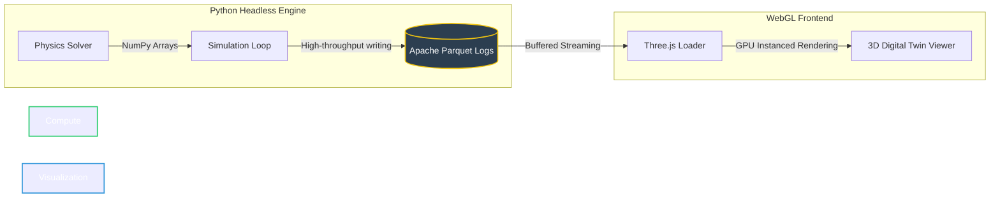

# 🌌 Lead Architect | CropForge

<p align="center">
  
</p>

<p align="center">
  <a href="https://github.com/saswatsundar123"></a>
  <a href="mailto:saswatsundar123@gmail.com"></a>
  <a href="https://linkedin.com/in/saswat-sundar-laha-7b4478227"></a>
</p>

---

### 🚀 The Mission

> **Bridging the gap between functional-structural plant biology (FSPM) and computational physics.**  
> I design and engineer high-performance, open-source scientific computing tools to model, simulate, and optimize agricultural ecosystems at scale.

---

## 🌾 The Centerpiece: CropForge

<table width="100%">
  <tr>
    <td>
      <h3>🔄 The Paradigm Shift</h3>
      <p>Legacy systems like DSSAT treat agricultural plots as zero-dimensional "black box" point models. <strong>CropForge</strong> dismantles this approach. It is a <strong>local-first, code-driven virtual farm environment</strong> providing a spatially explicit, 3D interactive digital twin ecosystem.</p>
      <ul>
        <li><strong>Spatially Explicit:</strong> Simulates light interception, water flow, and root-soil interactions in a true 3D space.</li>
        <li><strong>Interactive Ecosystem:</strong> Visualizes physical processes in real-time rather than hiding results in obscure text logs.</li>
      </ul>
    </td>
  </tr>
</table>

### 🏛️ The Decoupled Playback Architecture

CropForge is designed for ultimate performance and modularity by separating calculation from visualization:



* **Python Headless Compute:** Executes heavy biological and microclimatic equations.
* **Apache Parquet Log Serialization:** Compresses complex spatial temporal states into high-performance parquet files.
* **Three.js WebGL Renderer:** Consumes the parquet logs to replay the 3D growth curves, canopy structures, and voxelized soil moisture dynamics at 60 FPS.

---

### 🧬 Scientific & Physical Capabilities

- **Spatial Voxel Grids:** 3D soil-root models mapping nutrient concentration and water potential gradients dynamically.
- **Opt-in FAO-56 Penman-Monteith Physics:** Fully integrated canopy energy balance modeling for precise evapotranspiration calculations.
- **Multi-Field Scenario Dashboards:** Run parallel monte-carlo simulations across distinct regional parameters to forecast climate resilience.

---

## 🛠️ The Technical Stack

| Category | Technologies & Tools |
| :--- | :--- |
| **Compute & Biology** |    |
| **Data Streaming** |   |
| **Backend & APIs** |    |
| **Visualization** |   |

---

## 🔬 Engineering & Research Philosophy

### 💻 Code-First, Results-Later
We don't build closed-source, slider-based GUIs that limit scientific flexibility. We provide the geometric primitives, state arrays, and mathematical foundations directly—putting the full expressive power of biological equations back into the researchers' hands.

### 🔋 Batteries Included, But Removable
Every component is built for customization. CropForge ships with robust, pre-validated physical models out of the box, but exposes simple Python decorators for power users to override any mathematical equation or physiological logic.

```python
@cropforge.override("canopy_photosynthesis")
def custom_light_curve(leaf_area_index, photosynthetically_active_radiation):
    # Plug in your custom biochemical model here
    return custom_assimilation_rate
```

---

## ⚡ Secondary Ventures

While computational agriculture is my main obsession, I enjoy applying high-performance engineering to build community and web tools:

* **Vadraa:** A robust, high-performance software platform designed for modern enterprise workflows.
* **CampusKatha:** A community-driven, AI-agent content manager bridging student engagement, media distribution, and institutional storytelling.

---

## 📚 Connections & Citations

### 🎓 Academic Anchor
If you are using CropForge in academic research, modeling pipelines, or journal publications, please look out for our upcoming JOSS (Journal of Open Source Software) publication. In the meantime, you can cite the repository:

```bibtex
@software{cropforge2026,
  author = {Laha, Saswat Sundar},
  title = {CropForge: A Spatially Explicit 3D Plant Simulation and Virtual Farm Environment},
  year = {2026},
  publisher = {GitHub},
  journal = {GitHub Repository},
  howpublished = {\url{https://github.com/saswatsundar123/CropForge}}
}
```

---

### 📬 Get In Touch

* **LinkedIn:** [Saswat Sundar Laha](https://linkedin.com/in/saswat-sundar-laha-7b4478227)
* **Email:** [saswatsundar123@gmail.com](mailto:saswatsundar123@gmail.com)

> *"The ultimate validation of a plant model is not that it matches the field, but that it eventually replaces the need for a physical trial."*
