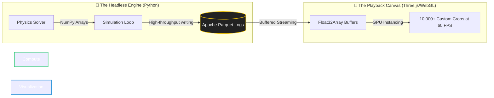

# 🌌 Hi! I am Saswat 

  

  
  
  

---

### 🚀 The Mission

> **I am a developer and researcher building high-performance, open-source scientific computing tools.**  
> My work focuses on bridging the gap between functional-structural plant biology and computational physics, providing researchers with the infrastructure they need to simulate, visualize, and scale agricultural digital twins.

---

## 🔬 Featured Research: CropForge

> **CropForge is a local-first, code-driven virtual farm environment designed for agricultural scientists.**  
> It moves beyond the "black box" of legacy point-models by providing a spatially explicit, 3D interactive digital twin ecosystem.

### 🏛️ The Decoupled Playback Architecture
The core innovation of this ecosystem is the complete separation of mathematical computation from visual rendering:

* **The Headless Engine:** The Python-based time-stepping engine processes complex biological and environmental physics, logging the entire spatial field state into highly optimized, columnar Apache Parquet files.
* **The Playback Canvas:** The frontend acts as an interactive mirror, reading the Parquet logs and streaming them as binary `Float32Array` buffers directly to the GPU. This allows researchers to render and scrub through timelines of 10,000+ custom crops without choking the browser thread.

---

## 💻 Core Technical Stack

| Domain | Technologies Used |
| :--- | :--- |
| **Compute & Logic** |  **Python 3.10+**,  **NumPy** |
| **Data Streaming** |  **Apache Parquet**,  **PyArrow** |
| **Backend API** |  **FastAPI**,  **Uvicorn** |
| **Visualization** |  **Three.js** (WebGL Instancing),  **Plotly Dash** |

---

## 🌱 Secondary Sandbox

While my primary engineering focus is on computational agriculture, I also apply my development skills to a few other domains:

* **Vadraa:** Exploring robust software solutions and digital platforms.
* **CampusKatha:** Building community-driven architecture and tools.

---

## 📬 Let's Connect

I am always open to discussing digital agriculture, systems architecture, or open-source scientific computing.

* **GitHub:** [saswatsundar123](https://github.com/saswatsundar123)
* **LinkedIn:** [Saswat Sundar Laha](https://linkedin.com/in/saswat-sundar-rath)
* **Email:** [saswatsundar123@gmail.com](mailto:saswatsundar123@gmail.com)

> *"We aren't just replacing field trials; we are providing the spatial environment that legacy models completely lack."*
